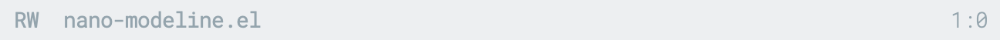
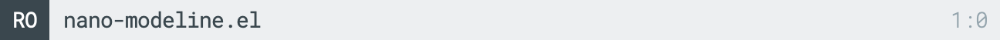
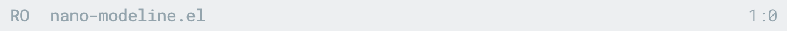
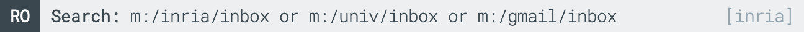

## N Λ N O Modeline

Nano modeline is a an alterntive to the GNU/Emacs modeline. It can be
displayed at the bottom (mode-line) or at the top (header-line)
depending on nano-modeline-position custom setting.

### Installation

Install with `M-: (package-install 'nano-modeline)`

### Usage example:

```emacs-lisp
(add-hook 'prog-mode-hook            #'nano-modeline-prog-mode)
(add-hook 'text-mode-hook            #'nano-modeline-text-mode)
(add-hook 'org-mode-hook             #'nano-modeline-org-mode)
(add-hook 'pdf-view-mode-hook        #'nano-modeline-pdf-mode)
(add-hook 'mu4e-headers-mode-hook    #'nano-modeline-mu4e-headers-mode)
(add-hook 'mu4e-view-mode-hook       #'nano-modeline-mu4e-message-mode)
(add-hook 'elfeed-show-mode-hook     #'nano-modeline-elfeed-entry-mode)
(add-hook 'elfeed-search-mode-hook   #'nano-modeline-elfeed-search-mode)
(add-hook 'term-mode-hook            #'nano-modeline-term-mode)
(add-hook 'xwidget-webkit-mode-hook  #'nano-modeline-xwidget-mode)
(add-hook 'messages-buffer-mode-hook #'nano-modeline-message-mode)
(add-hook 'org-capture-mode-hook     #'nano-modeline-org-capture-mode)
(add-hook 'org-agenda-mode-hook      #'nano-modeline-org-agenda-mode)
```


### Screenshots (using [N Λ N O theme](https://github.com/rougier/nano-theme)):










