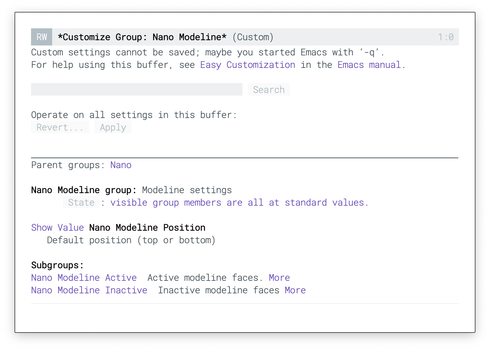
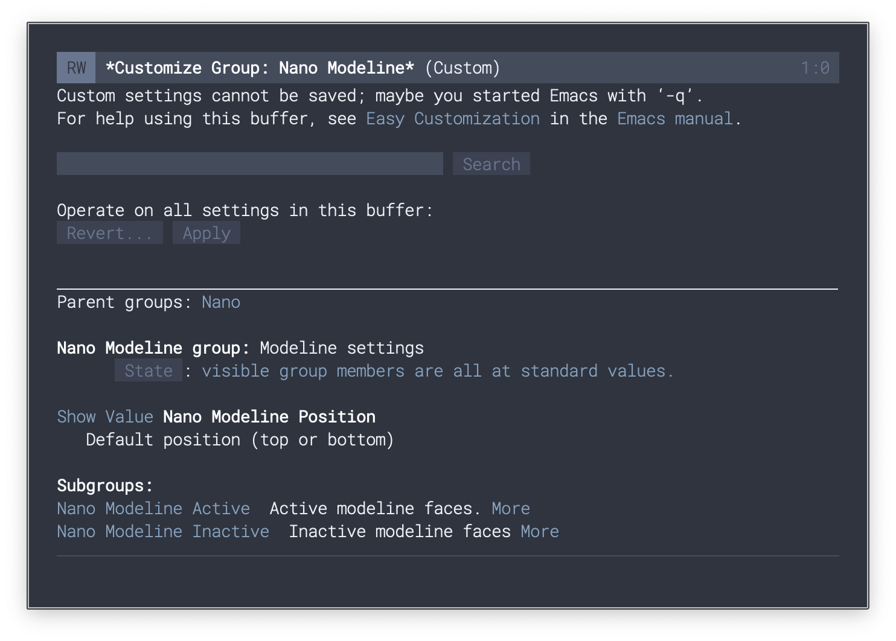
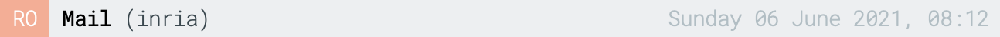
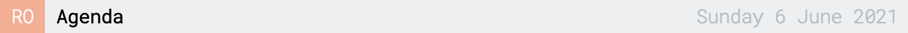
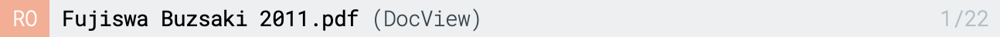

## N Λ N O Modeline

A simple modeline. Best with [N Λ N O theme](https://github.com/rougier/nano-theme).


<div>


</div>










### Installation

Install with `M-: (package-install 'nano-modeline)`


### Usage

```
(nano-modeline)
```
