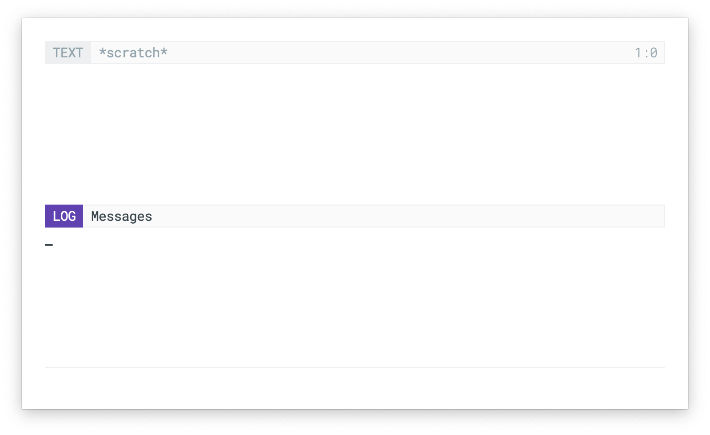

## N Λ N O Modeline

Nano modeline is a minor mode for GNU/Emacs that modify the modeline as:

`[ status | name (primary)                               secondary ]`

It can be displayed at the bottom (mode-line) or at the top (header-line)
depending on nano-modeline-position custom setting.

There are two sets of faces (for active and inactive modelines) that
can be customized (M-x: customize-group + nano-modeline)

- `nano-modeline-active-name`      / `nano-modeline-inactive-name`
- `nano-modeline-active-primary`   / `nano-modeline-inactive-primary`
- `nano-modeline-active-secondary` / `nano-modeline-inactive-secondary`
- `nano-modeline-active-status-RO` / `nano-modeline-inactive-status-RO`
- `nano-modeline-active-status-RW` / `nano-modeline-inactive-status-RW`
- `nano-modeline-active-status-**` / `nano-modeline-inactive-status-**`

### Installation

Install with `M-: (package-install 'nano-modeline)`

### Usage example:

Activate with ` M-x: nano-modeline-mode`

### Screenshots (using [N Λ N O theme](https://github.com/rougier/nano-theme)):

