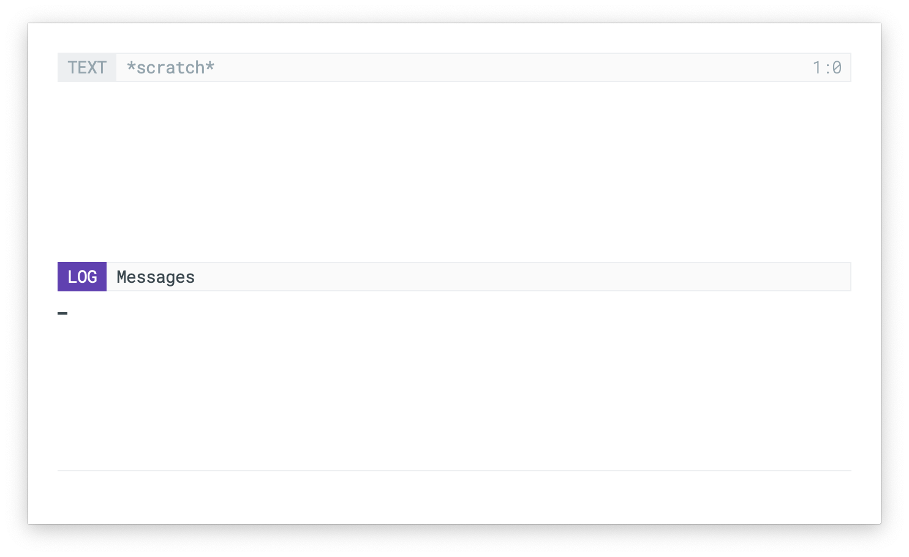

## N Λ N O Modeline

Nano modeline is a an alternative to the GNU/Emacs modeline. It can be
displayed at the bottom (mode-line) or at the top (header-line). It is
roughly organized as:

`[ status | primary (secondary)                               extra ]`

There are several modelines that can be installed on a per-mode basis
or be made the default one. Currently, only the prog and text mode are
generic enough to be made the default. You can also design your own
modeline using the various elements composing a modeline. See sources
for several example.

### Installation

Install with `M-: (package-install 'nano-modeline)`

### Usage example:

```emacs-lisp
(add-hook 'mu4e-headers-mode-hook  #'nano-modeline-mu4e-headers)
(add-hook 'mu4e-view-mode-hook     #'nano-modeline-mu4e-view)
(add-hook 'mu4e-compose-mode-hook  #'nano-modeline-mu4e-compose)
(add-hook 'mu4e-update-pre-hook    #'nano-modeline-mu4e-update)
(add-hook 'elfeed-search-mode-hook #'nano-modeline-elfeed-search)
(add-hook 'elfeed-show-mode-hook   #'nano-modeline-elfeed-show)
(add-hook 'term-mode-hook          #'nano-modeline-terminal)
(add-hook 'eat-mode-hook           #'nano-modeline-terminal)
(add-hook 'calendar-mode-hook      #'nano-modeline-calendar)
(add-hook 'org-agenda-mode-hook    #'nano-modeline-org-agenda)
(add-hook 'dired-mode-hook         #'nano-modeline-dired)
```

To make a specific mode the default one, you can type:

```emacs-lisp
(nano-modeline 'header t)
```

Currently, only the prog and text mode are generic enough to be made the
default.


### Screenshots (using [N Λ N O theme](https://github.com/rougier/nano-theme)):




